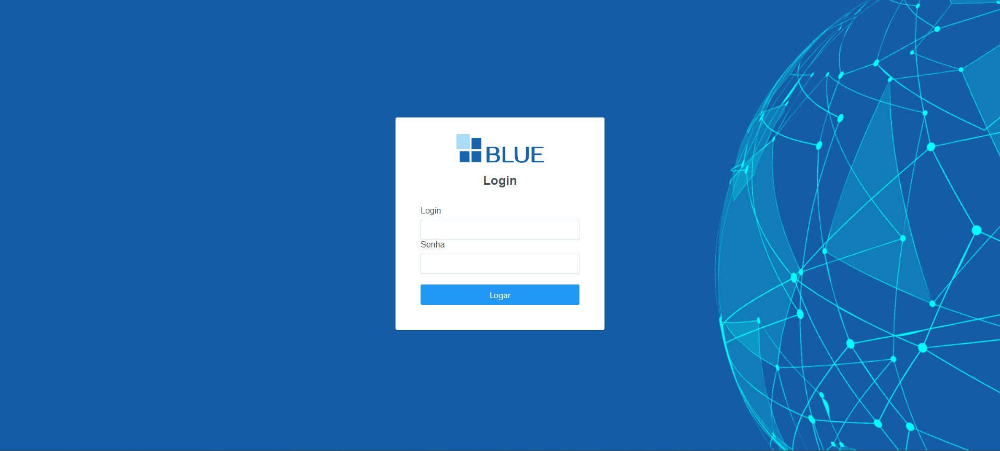

# Sistema de Agendamento Blue

Este sistema foi desenvolvido seguindo os padrões da Clean Architecture e CQRS. Um dos objetivos era conectar a aplicação a uma fila no RabbitMQ, mas isso não foi viável devido às limitações de tempo.

A aplicação é containerizada, com cada pasta contendo um Dockerfile com as respectivas configurações para garantir o funcionamento ideal das aplicações. Além disso, há um Docker Compose para orquestrar os containers.

##Como rodar a aplicação
Para rodar a aplicação será necessario rodar um container a parte em relação aoo  compose por que o compose inffelizmente
não possui algum comando que faça com que o container do back-end faça esperar o container subir para executar, então primeiro teremos
que rodar o container do banco de dados para assim subir o compose .

### Passo a passo
execute os seguintes comandos no bash no caminho do projeto 

- Acesse a pasta que está com as configurações do Docker
~~~bash
cd database
~~~
- crie a imagem do banco
~~~bash
sudo docker build -t data_base_app .
~~~
- suba o container com o seguinte comando
~~~bash
sudo docker run -e "ACCEPT_EULA=Y" -e "SA_PASSWORD=MinhaSenhaForte123!" -p 1433:1433  -d --name sql_db  data_base_app
~~~
- Volte para a raiz do sistema
~~~bash
cd ..
~~~
- Execute o compose 
~~~bash
sudo docker compose up
~~~
## Acesso ao Sistema

Após subir os containers com o Docker Compose, será possível acessar a aplicação utilizando as seguintes credenciais:

| URL                      | Login             | Senha |
|--------------------------|-------------------|-------|
| [http://localhost:8080/](http://localhost:8080/) | admin@blue.com | admin |
